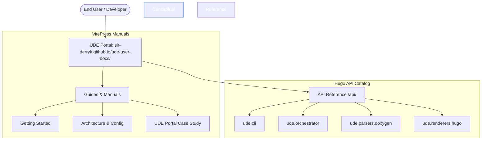

# UDE Portal — Documentation Blueprint & Case Study

This document establishes the architecture, content map, and implementation plan for **UDE Portal**, the official online documentation suite for the **Universal Documentation Engine (UDE)**. 

To demonstrate the full power and reliability of UDE, the documentation suite operates on a **self-documenting "dogfooding" principle**: the UDE codebase compiles its own API reference dynamically, nesting it directly into the public VitePress guides.

---

## 📐 Hybrid Portal Architecture

UDE Portal uses a hybrid, multi-layered architecture powered by **UDE Publisher** (the GitHub Actions CI/CD orchestration layer):

### 1. VitePress (Conceptual Layer)
*   **Host Location**: Root paths (`/`, `/guides/`, `/config/`).
*   **Purpose**: Delivers premium-quality, high-speed Single Page Application (SPA) user guides, configuration specs, and architectural overviews.
*   **Aesthetics**: Custom-tailored dark mode, smooth client-side transitions, and clean layout cards.

### 2. Hugo (Technical Reference Layer)
*   **Host Location**: Nested sub-path (`/api/`).
*   **Purpose**: Renders the complete, cross-linked API Reference of the UDE engine's Python modules.
*   **Compilation**: Compiled dynamically by the UDE compiler's `HugoMarkdownRenderer` from raw Python docstrings and injected straight into `.vitepress/dist/api/` post-VitePress build.

---

## 🗺️ Portal Content Map & Site Map

### 1. Landing Page (`/`) — The Gateway
A highly polished, conversion-oriented developer portal landing page:
*   **Hero Section**:
    *   **Title**: `Universal Documentation Engine`
    *   **Tagline**: *Beautiful, fast, and structured developer portals generated directly from your codebase.*
    *   **Call-to-Action Buttons**:
        *   `Get Started` ➔ Redirects to `/guides/getting-started`
        *   `Explore API Reference (Live Demo)` ➔ Redirects to `/api/`
        *   `Read the Case Study` ➔ Redirects to `/guides/case-study`
*   **Features Grid**:
    *   **Multi-Platform Target**: Extracts clean documentation from C++, C#, Java, and Python environments.
    *   **Two-Level Build Cache**: Minimizes disk I/O and build times by tracking entity signatures.
    *   **Agnostic Intermediate Representation (IR)**: Decouples AST parsing from target formatting (Markdown, HTML, or RAG-ready JSON).
    *   **AI & RAG Ready**: Seamlessly exports structured JSON metadata to bootstrap LLMs over codebases.

---

### 2. VitePress Guides (`/guides/`)

#### 📂 Chapter 1: Quick Start
*   **`getting-started.md`**: Environment prerequisites (Python 3.11, Doxygen in PATH), quick installation via `pip`, and running a test compilation in under 10 seconds.
*   **`first-config.md`**: Writing your first target `ude_config.json` to link source collectors to output directories.

#### 📂 Chapter 2: Coding & Commenting Standards
*   **`commenting-rules.md`**: How to document source code. Explains support for Javadoc (`@param`), Doxygen (`\return`), and Google-style docstrings, and how UDE normalizes them to CommonMark.
*   **`exclusion-gates.md`**: Using exclusion filters to keep internal API clutter clean. Demonstrates `@internal`, `@cond / @endcond`, and `DOM-IGNORE-BEGIN / DOM-IGNORE-END` blocks.

#### 📂 Chapter 3: Configurations Reference
*   **`global-settings.md`**: Exhaustive schema reference for `ude_global.json` (logging thresholds, caching strategies, and safe folder-cleanup patterns).
*   **`target-settings.md`**: Detailed options for custom collectors, parsers, and renderer engines.

#### 📂 Chapter 4: Live Case Study — How This Portal is Built
*   **`case-study.md`**: The crowning tutorial of UDE Portal. It provides a transparent, step-by-step breakdown of how this very portal compiles itself.
*   **Contents**:
    *   **Windows Directory Junctions**: Explains the local directory link `user-docs/engine` pointing to `../engine` to emulate CI environments locally.
    *   **Self-Config file**: Analyzes `user-docs/ude_config_self.json` which maps Python parser inputs to Hugo-markdown templates.
    *   **UDE Publisher CI/CD pipeline**: Explains `.github/workflows/deploy.yml` build-order tricks:
        1. Setup environment and install Doxygen.
        2. Generate API markdown via Python cli.
        3. Compile VitePress guides (`npm run docs:build`) into `.vitepress/dist`.
        4. Run Hugo to compile API references and output directly to `.vitepress/dist/api`.
        5. Upload and deploy `.vitepress/dist` to GitHub Pages.

---

### 3. Hugo API Reference (`/api/`)

The API documentation section is compiled directly from the `engine/ude/` modules, showcasing UDE’s ability to parse object-oriented structures and generate cross-linked, readable directories:

| Package/Module | Component Description | Showcase Highlight |
| :--- | :--- | :--- |
| **`ude.cli`** | Main CLI parser and argument handler | Non-interactive shell execution, custom exit codes. |
| **`ude.orchestrator`** | `UdeOrchestrator` execution controller | Path portability resolving, sequential stages handling. |
| **`ude.collectors`** | `BaseCollector` & `DoxygenXmlCollector` | Safe subprocess execution, rigid directory cleanup routines. |
| **`ude.parsers`** | `BaseParser` & `DoxygenXmlParser` | Templates extraction (`<T>`), SWIG structures filtering. |
| **`ude.renderers`** | `HugoMarkdownRenderer` & `HtmlRenderer` | Escaping template brackets, offline collapse-sidebar sidebar portal. |
| **`ude.models`** | Pydantic IR schema specifications | compressed Gzip serialization (`.json.gz`). |
| **`ude.cache`** | `BuildCacheManager` L1 & L2 engines | Signatures hashing and file skip logic. |

---

## 📋 Portal-Specific Quality Requirements

### REQ-PORTAL-01 (Manual Sidebar Quality Gate)
All manually configured sidebars (such as in Docusaurus `sidebars.ts` or VitePress `.vitepress/config.js`) must be clean and fully populated.
*   **Rule**: Collapsible sidebar categories/folders must not contain empty sub-lists or placeholders.
*   **Purpose**: Ensures that the user never encounters a "broken" or empty navigation node in the hand-written parts of the documentation portal.

---

## 📈 Road to Release

To bring UDE Portal to its final, public-ready form, we follow this roadmap:

1.  **[DONE] Build Order Patch**: Fix VitePress output cleaning by compiling Hugo directly into `.vitepress/dist/api`.
2.  **[PENDING] Populate Guides**: Write the Markdown source files under `user-docs/content/` for Chapters 1-4.
3.  **[PENDING] Codebase Docstring Review**: Add high-quality docstrings in Javadoc/Google format to all classes inside `engine/ude/` to ensure the generated `/api` matches the premium quality of the guides.
4.  **[PENDING] Live Tag Release**: Tag a release `v1.0.0` to trigger a clean compilation and lock the documentation state.

> [!NOTE]
> Since UDE is fully cross-platform and offline-capable, users can download a complete offline-ready `.zip` containing the Standalone HTML compiler's output directly from the GitHub Release Assets panel.

