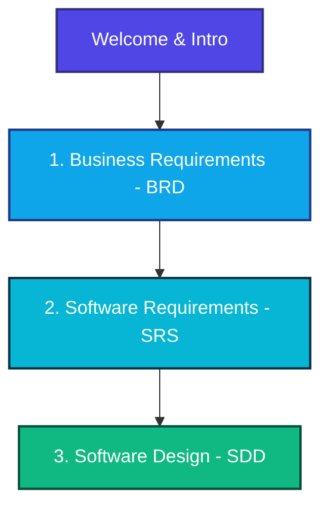

# Universal Document Engine — Project Specifications

Welcome to the **Universal Document Engine (UDE)** specifications and architectural blueprint portal. This workspace contains the complete development lifecycle documentation, following the **Docs-as-Code** paradigm.

## 🧭 Navigation Portal

Select one of the specialized documents from the sidebar or click below to explore the specifications:

### 📋 Section Directory

* **[1. Business Requirements Document (BRD)](/brd/)**
  * Describes the business context, pain points (Legacy Doxygen HTML, desynchronization), and the overarching objective of UDE.
  * Contains core business goals: `REQ-BUS-01` through `REQ-BUS-04`.
* **[2. Software Requirements Specification (SRS)](/srs/)**
  * Detailing full functional specifications for parsing (XML Ingestion, Entity Extraction) and rendering modules (Hugo and structured AI RAG).
  * Outlines system performance, test coverage, and architectural modularity NFRs.
* **[3. Software Design Document (SDD)](/sdd/)**
  * Outlines the pipeline-driven design decoupling the parsing frontends from template-driven markdown backends.
  * Maps intermediate representation (IR) schemas and dataclass models.

---

> [!NOTE]
> All changes to these specifications are strictly revision-controlled and must undergo Peer Review through Pull Requests (PR) as defined in the [.rules.md](file:///D:/My%20repositories/Pipeline/.antigravitycli/.rules.md) and [requirements_style.md](file:///D:/My%20repositories/Pipeline/.antigravitycli/styles/requirements_style.md).
