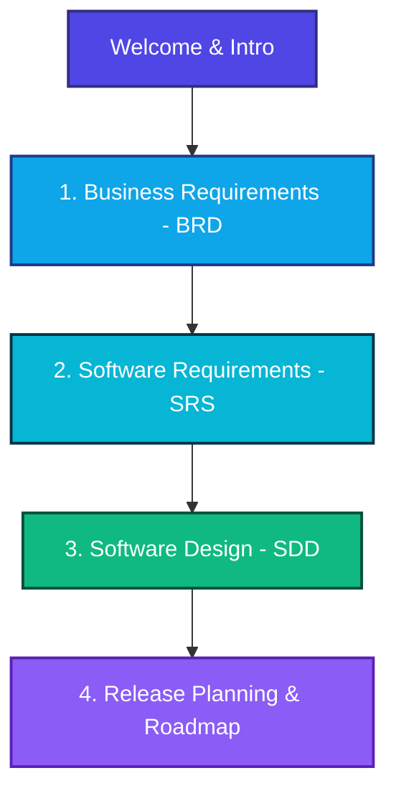

# Universal Documentation Engine — Project Specifications

Welcome to the **Universal Documentation Engine (UDE)** specifications and architectural blueprint portal. This workspace contains the complete development lifecycle documentation, following the **Docs-as-Code** paradigm.

## 🧭 Navigation Portal

Select one of the specialized documents from the sidebar or click below to explore the specifications:

### 📋 Section Directory

* **[1. Business Requirements Document (BRD)](./brd/index.md)**
  * Describes the business context, goals, and key motivations behind UDE.
  * **Sections**: [Introduction & Objectives](./brd/index.md), [Business Context & Pain Points](./brd/context.md), [Business Requirements](./brd/requirements.md), [Scope & Constraints](./brd/scope.md).
* **[2. Software Requirements Specification (SRS)](./srs/index.md)**
  * Specifying detailed functional and non-functional requirements for the pipeline engine.
  * **Sections**: [Introduction & System Overview](./srs/index.md), [Functional Requirements](./srs/functional.md), [Non-Functional Requirements](./srs/non_functional.md).
* **[3. Software Design Document (SDD)](./sdd/index.md)**
  * Outlines the pipeline-driven architecture and intermediate representation formats.
  * **Sections**: [Introduction & Paradigm](./sdd/index.md), [Architectural Design](./sdd/architecture.md), [Data Model (IR)](./sdd/data_model.md).
* **[4. Release Planning & Roadmap](./roadmap/index.md)**
  * Details how the business and system requirements map to specific release cycles.
  * **Sections**: [Document Version History](./roadmap/index.md), [MVP (v1.0) Release Plan](./roadmap/mvp_v1/requirements.md), [Future Releases (v2.0+)](./roadmap/future_v2.md).

---
