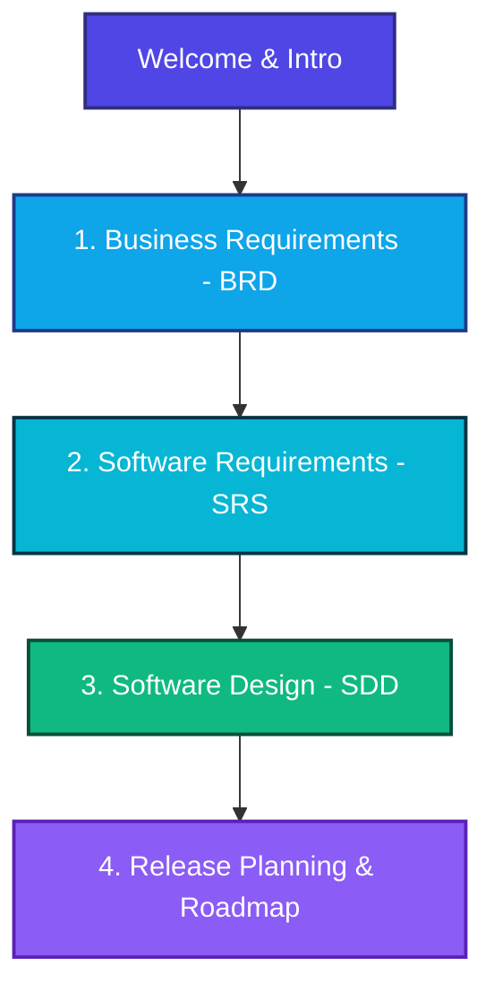

# Universal Document Engine — Project Specifications

Welcome to the **Universal Document Engine (UDE)** specifications and architectural blueprint portal. This workspace contains the complete development lifecycle documentation, following the **Docs-as-Code** paradigm.

:::info Document Version Information
* **Current Document Version**: `0.1`
* **Status**: `Requirements Gathering & Draft Specifications` (сбор требований)
* **Date**: June 7, 2026
:::

## 🧭 Navigation Portal

Select one of the specialized documents from the sidebar or click below to explore the specifications:

### 📋 Section Directory

* **[1. Business Requirements Document (BRD)](/docs/brd/)**
  * Describes the business context, goals, and key motivations behind UDE.
  * **Sections**: [Introduction & Objectives](/docs/brd/), [Business Context & Pain Points](/docs/brd/context), [Business Requirements](/docs/brd/requirements), [Scope & Constraints](/docs/brd/scope).
* **[2. Software Requirements Specification (SRS)](/docs/srs/)**
  * Specifying detailed functional and non-functional requirements for the pipeline engine.
  * **Sections**: [Introduction & System Overview](/docs/srs/), [Functional Requirements](/docs/srs/functional), [Non-Functional Requirements](/docs/srs/non_functional).
* **[3. Software Design Document (SDD)](/docs/sdd/)**
  * Outlines the pipeline-driven architecture and intermediate representation formats.
  * **Sections**: [Introduction & Paradigm](/docs/sdd/), [Architectural Design](/docs/sdd/architecture), [Data Model (IR)](/docs/sdd/data_model).
* **[4. Release Planning & Roadmap](/docs/roadmap/)**
  * Details how the business and system requirements map to specific release cycles.
  * **Sections**: [Document Version History](/docs/roadmap/), [MVP (v1.0) Release Plan](/docs/roadmap/mvp_v1), [Future Releases (v2.0+)](/docs/roadmap/future_v2).

---

> [!NOTE]
> All changes to these specifications are strictly revision-controlled and must undergo Peer Review through Pull Requests (PR) as defined in the [.rules.md](file:///D:/My%20repositories/Pipeline/.antigravitycli/.rules.md) and [requirements_style.md](file:///D:/My%20repositories/Pipeline/.antigravitycli/styles/requirements_style.md).
