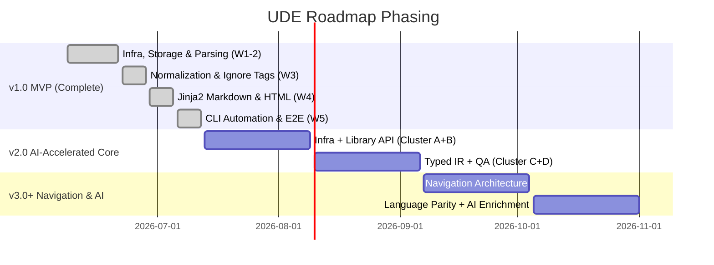

# Release Planning & Document History

This section details how the business and software requirements of the **Universal Documentation Engine (UDE)** are distributed across developmental release milestones, and tracks the version history of this specification document.

## Document Version History

We track the revisions of these specifications using a structured versioning schema:

| Doc Version | Date | Phase Description | Lead Author | Status |
| :--- | :--- | :--- | :--- | :--- |
| **`0.7`** | **2026-06-28** | **Requirements audit & v2.0 roadmap finalization** | **pavel.sokolov** | **Draft (Active)** |
| **`0.6`** | **2026-06-13** | **Testing and bug fixing** | **Sir Derryk** | **Approved (Superceded)** |
| **`0.5`** | **2026-06-13** | **Testing documentation** | **Sir Derryk** | **Approved (Superceded)** |
| **`0.4`** | **2026-06-11** | **Developing documentation** | **Sir Derryk** | **Approved (Superceded)** |
| **`0.3`** | **2026-06-09** | **Developing prototype** | **Sir Derryk** | **Approved (Superceded)** |
| **`0.2`** | **2026-06-08** | **Planning MVP** | **Sir Derryk** | **Approved (Superceded)** |
| **`0.1`** | **2026-06-07** | **Requirements gathering** | **Sir Derryk** | **Approved (Superceded)** |

* **Version 0.7 Scope**: Full requirements audit of the implemented codebase against the design specification. Gap analysis matrix finalized (GAPs 01–32). v1.0 MVP requirements authorised. v2.0 "AI-Accelerated Core & Quality Upgrade" roadmap scoped (10 items across 4 clusters). v3.0+ navigation architecture and language parity work formally deferred. Design docs updated to reflect actual v1.0 state.
* **Version 0.6 Scope**: Comprehensive software testing, regression bug fixing, and implementation of automated navigation structures in the UDE code generator (eliminating pageless sidebar categories and generating dedicated namespace pages).
* **Version 0.5 Scope**: Comprehensive verification and testing of compiled documentation portals, sanitization of internal development metadata, and final deployment quality assurance.
* **Version 0.4 Scope**: Comprehensive design, planning, and deployment of the hybrid online documentation portal (UDE Portal), including the GHA CI/CD publication workflow (UDE Publisher).
* **Version 0.3 Scope**: Active core implementation of Python-based UDE prototype according to TDD methodologies (Weeks 1 to 5).
* **Version 0.2 Scope**: Granular scheduling of 12 TDD tasks across 5 weeks, preparing executable development task specifications, and updating Docusaurus navigation layouts.
* **Version 0.1 Scope**: Gathering high-level business goals (BRD), defining system functional/non-functional constraints (SRS), drafting the pipeline design (SDD), and mapping out the implementation schedule.

---

## Release Planning Summary

The implementation of UDE is structured into three release tiers, each building on a fully delivered predecessor:

1. **[MVP (v1.0) Release Plan](./mvp_v1/requirements.md)**: Delivered. Core parsing (Doxygen XML → IR), CommonMark normalization, HTML and Hugo Markdown rendering for C++, C#, Java, and Python, 3-way config cascade, fault-tolerance, L1 parse cache, and a 23-test unit and functional test suite.
2. **[v2.0 — AI-Accelerated Core & Quality Upgrade](./future_v2.md)**: 10 items across 4 clusters — Infrastructure modernisation (global config, logging, L2 cache, Doxyfile key-level merge), Library API & CLI unification (UdeOrchestrator public API, subcommands), Typed IR (7 Pydantic entity models), and QA completeness (coverage gate, external script confirmation, per-language integration suites).
3. **[v3.0+ — Navigation Architecture & AI](./future_v2.md#version-30--deferred-roadmap)**: Navigation breaking changes (`sidebar.toml` required, `toc_*.json` removal), language render parity, LLM docstring enrichment, multi-language translation, RAG/XML output formats, and native language parsers.
