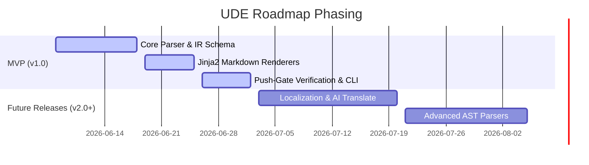

# 4. Release Planning & Document History

This section details how the business and software requirements of the **Universal Document Engine (UDE)** are distributed across developmental release milestones, and tracks the version history of this specification document.

## Document Version History

We track the revisions of these specifications using a structured versioning schema:

| Doc Version | Date | Phase Description | Lead Author | Status |
| :--- | :--- | :--- | :--- | :--- |
| **`0.1`** | **2026-06-07** | **Requirements Gathering & Initial Draft** | **Antigravity AI** | **Approved (Current)** |

* **Version 0.1 Scope**: Gathering high-level business goals (BRD), defining system functional/non-functional constraints (SRS), drafting the pipeline design (SDD), and mapping out the implementation schedule.

---

## Release Planning Summary

To guarantee a fast, stable, and highly predictable development process, the implementation of UDE is structured into two main releases:

1. **[MVP (v1.0) Release Plan](./mvp_v1.md)**: Focuses on core parsing, AST extraction, CommonMark rendering, push-gating, and complete local execution.
2. **[Future Releases (v2.0+)](./future_v2.md)**: Introduces AI translation workflows, asynchronous translation lifecycle status databases, XLIFF import/export subcommands, and tree-sitter direct code parsers.
