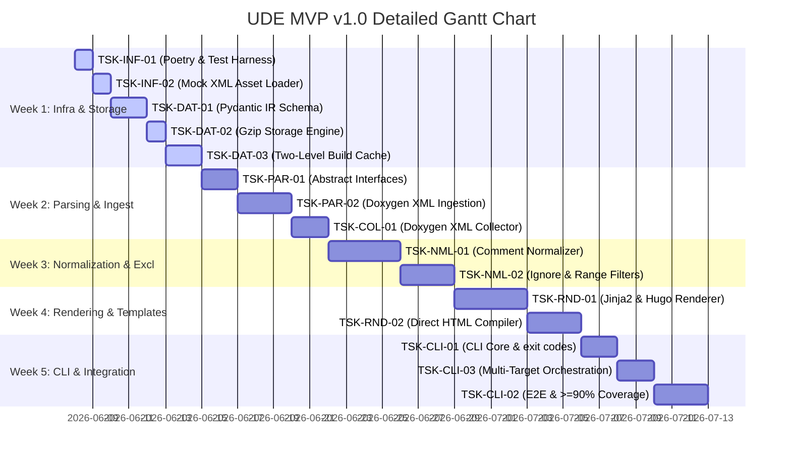

# MVP Execution Plan & Milestone Schedule

This document presents the week-by-week implementation plan for the **Universal Documentation Engine (UDE) MVP v1.0**. 

The plan spans **5 weeks**, progressing systematically through core infrastructure, parsing, normalization, rendering, and automated integration gates.

---

## 🗓️ Weekly Execution Roadmap

---

## 📅 Milestone Details

### 📍 Week 1: Core Testing & Storage Foundations
*   **Objectives**: Initialize testing frameworks, load mock assets, implement Pydantic IR data validation, Gzip disk persistence, and build caching.
*   **Deliverables**:
    *   **Poetry Configuration**: Complete `pyproject.toml` and lock files (`TSK-INF-01`).
    *   **Mock Asset Loader**: Set up unit test directories and Mock XML loaders (`TSK-INF-02`).
    *   **Pydantic Models**: Core validation structures for Project, Class, and Methods (`TSK-DAT-01`).
    *   **Gzip Transparent I/O**: High-performance, compressed serialization engine (`TSK-DAT-02`).
    *   **Two-Level Build Cache**: Incremental caching for parsed ASTs and output rendering files (`TSK-DAT-03`).
*   **TDD Checkpoint**: 100% green unit tests on test harness structure, data validation schema boundaries, file decompression/compression byte matching, and build caching increments.

### 📍 Week 2: Abstract Contracts, Collectors & Multi-Language Ingestion
*   **Objectives**: Create abstract module contracts, implement secure pre-processing collectors, and parse Doxygen XML into unified IR.
*   **Deliverables**:
    *   **Abstract Base Classes**: `BaseParser` and `BaseRenderer` ABCs and exception types (`TSK-PAR-01`).
    *   **Doxygen XML Ingestion**: Live parser and structural extractors (`TSK-PAR-02`).
    *   **Doxygen XML Collector**: Standard environment validation and subprocess-driven Doxygen runner with secure cleanups (`TSK-COL-01`).
*   **TDD Checkpoint**: Green unit tests asserting proper interface structures, subprocess executions, directory guard rails, and XML schema mapping for C++ structs, C# automatic properties, Java packages, and Python classes.

### 📍 Week 3: Docstring Normalization & Exclusion Gates
*   **Objectives**: Standardize diverse docstring formats into CommonMark Markdown and implement block-range ignore tags.
*   **Deliverables**:
    *   **Comment Normalizer**: Markdown translator for Javadoc, Google, and Doxygen docstring schemas (`TSK-NML-01`).
    *   **Ignore Tags Filters**: Regex/structural pre-filters for `DOM-IGNORE-BEGIN`/`DOM-IGNORE-END`, `@cond`, and `@internal` blocks (`TSK-NML-02`).
*   **TDD Checkpoint**: Green unit tests verifying block-range skipping and Javadoc parameter strip-to-CommonMark conversions.

### 📍 Week 4: Template-Based Multi-Format Rendering
*   **Objectives**: Implement template compile rules for Hugo markdown and Direct static HTML pages.
*   **Deliverables**:
    *   **Hugo Markdown Rendering**: Template compilation engine with YAML metadata layout injection (`TSK-RND-01`).
    *   **Static HTML Compiles**: Standalone, localized local HTML page generators (`TSK-RND-02`).
*   **TDD Checkpoint**: Green unit tests verifying correct Markdown and HTML syntax generation and front-matter template variables injection.

### 📍 Week 5: Command-Line Automation, Multi-Target Orchestration & End-to-End Release
*   **Objectives**: Build the automation entrypoint, implement config-relative multi-target orchestration, integrate all pipeline components, and optimize unit test coverage.
*   **Deliverables**:
    *   **Non-Interactive CLI**: Entrypoint script with exit codes and CLI arguments parsing (`TSK-CLI-01`).
    *   **Centralized Orchestrator**: Config-based path-portable pipeline manager with error policies and automatic cleanups (`TSK-CLI-03`).
    *   **Integration Tests**: Comprehensive E2E pipelines testing the complete XML ➡️ IR ➡️ Gzip ➡️ HTML/Hugo compilation (`TSK-CLI-02`).
*   **TDD Checkpoint**: Full green status on all unit, integration, and path-portability orchestration suites; global unit test coverage strictly `>= 90%` (`REQ-NFN-03`).

---

## 📈 Quality Gates & Acceptance Criteria

To declare the MVP completed and ready for production deployment, the code must successfully pass the following verification gates:

1.  **Test Coverage Gate**: Global coverage computed via `pytest-cov` must be at least **`90%`**.
2.  **Execution Velocity Gate**: Dynamic ingestion, parsing, and rendering of up to **`1,000 API classes`** must complete in **`< 5 seconds`** on a standard GitHub Actions virtualized environment.
3.  **Git Hygiene Gate**: Verification that the repository remains 100% free of compiled documentation output files and contains only Gzip-compressed intermediate artifacts (`.json.gz`).

