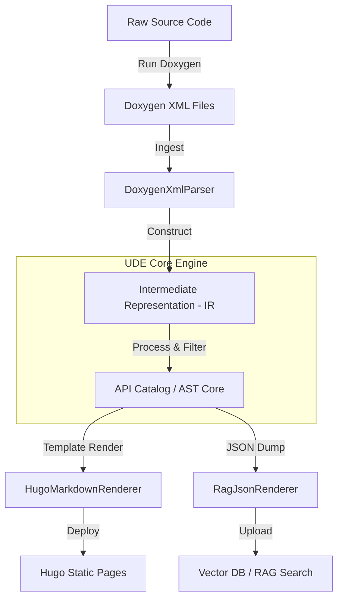

# Software Design Document (SDD) — Universal Document Engine (UDE)

## 1. Introduction
### 1.1 Document Purpose
This document details the high-level and low-level architectural design, data models, and component contracts of the **Universal Document Engine (UDE)**.

### 1.2 Architectural Paradigm
UDE employs a **Pipeline (Frontend-Backend) Architecture** to ensure that raw code parsing is completely decoupled from documentation formatting. This ensures maximum extensibility.

---

## 2. Architectural Design



### Component Breakdown
* **`BaseParser`**: Abstract interface for all frontends.
  * *Satisfies*: `REQ-NFN-02`
* **`DoxygenXmlParser`**: Parses Doxygen XML models into a structured in-memory AST.
  * *Satisfies*: `REQ-FUN-01`, `REQ-FUN-02`
* **`Intermediate Representation (IR)`**: A strict, language-agnostic data model mapping code hierarchies (Namespaces, Classes, Methods, Enums, Variables, Parameters, Returns).
* **`BaseRenderer`**: Abstract interface for all backends.
  * *Satisfies*: `REQ-NFN-02`
* **`HugoMarkdownRenderer`**: Compiles UDE IR into static Markdown pages using **Jinja2** templates.
  * *Satisfies*: `REQ-FUN-03`, `REQ-FUN-04`
* **`RagJsonRenderer`**: Compiles UDE IR into semantic-friendly JSON chunk documents.
  * *Satisfies*: `REQ-FUN-05`

---

## 3. Data Model (Intermediate Representation)

The core data structure (IR) will be defined using standard Python `dataclasses` (enforcing PEP 8 styling):

```python
from dataclasses import dataclass, field
from typing import List, Optional

@dataclass
class ParameterModel:
    name: str
    type_name: str
    description: str

@dataclass
class MethodModel:
    name: str
    return_type: str
    parameters: List[ParameterModel] = field(default_factory=list)
    description: str = ""
    access: str = "public"  # public, protected, private

@dataclass
class ClassModel:
    name: str
    namespace: str
    methods: List[MethodModel] = field(default_factory=list)
    description: str = ""
    file_path: str = ""
```
