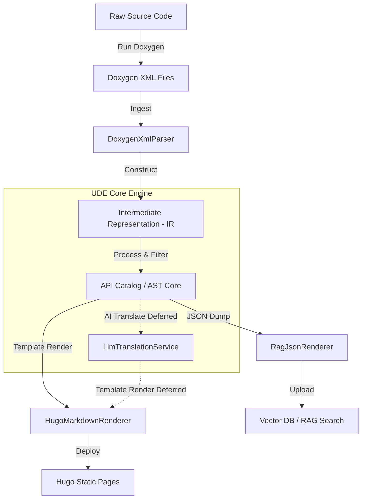

# Architectural Design

:::info Document Version Information
* **Current Document Version**: `0.1`
* **Status**: `Requirements Gathering & Draft Specifications`
* **Date**: June 7, 2026
:::

The architectural design decoupling parsing frontends from rendering backends is outlined below:

## Component Breakdown
* **`BaseParser`**: Abstract interface for all frontends.
  * *Satisfies*: `REQ-NFN-02`
* **`DoxygenXmlParser`**: Parses Doxygen XML models into a structured in-memory AST.
  * *Satisfies*: `REQ-FUN-01`, `REQ-FUN-02`
* **`Intermediate Representation (IR)`**: A strict, language-agnostic data model mapping code hierarchies (Namespaces, Classes, Methods, Enums, Variables, Parameters, Returns).
* **`LlmTranslationService` [DEFERRED - Future Phase (v2.0+)]**: Optional helper service that integrates with an external LLM API (e.g., Gemini) to translate description blocks inside the IR, enabling zero-effort multilingual generation.
  * *Satisfies*: `REQ-FUN-06`
* **`BaseRenderer`**: Abstract interface for all backends.
  * *Satisfies*: `REQ-NFN-02`
* **`HugoMarkdownRenderer`**: Compiles UDE IR into static Markdown pages using **Jinja2** templates.
  * *Satisfies*: `REQ-FUN-03`, `REQ-FUN-04`
* **`RagJsonRenderer`**: Compiles UDE IR into semantic-friendly JSON chunk documents.
  * *Satisfies*: `REQ-FUN-05`
