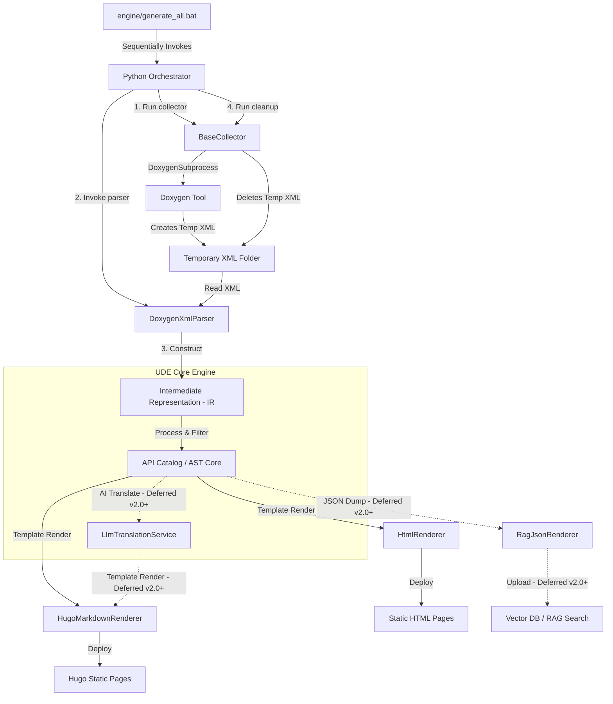

# Architectural Design

The architectural design decoupling parsing frontends from rendering backends is outlined below:

## Component Breakdown
* **`BaseCollector`**: Abstract interface for preprocessing and data gathering stages. It manages the lifecycle of intermediate files (e.g. running Doxygen to compile C++ headers into temporary XML outputs) and ensures absolute deletion of temporary directory trees.
  * *Satisfies*: `REQ-FUN-01`, `REQ-FUN-22`
* **`BaseParser`**: Abstract interface for all frontends.
  * *Satisfies*: `REQ-NFN-02`
* **`DoxygenXmlParser`**: Parses Doxygen XML models (located in the temporary directory prepared by the collector) into a structured in-memory AST, respecting ignore tags (`DOM-IGNORE-BEGIN`/`DOM-IGNORE-END`, `\cond`, `\internal`).
  * *Satisfies*: `REQ-FUN-02`, `REQ-FUN-13`
* **`Intermediate Representation (IR)`**: A strict, language-agnostic data model mapping code hierarchies (Namespaces, Classes, Methods, Enums, Variables, Parameters, Returns).
* **`LlmTranslationService` [DEFERRED - Future Phase (v2.0+)]**: Optional helper service that integrates with an external LLM API (e.g., Gemini) to translate description blocks inside the IR, enabling zero-effort multilingual generation.
  * *Satisfies*: `REQ-FUN-06`
* **`BaseRenderer`**: Abstract interface for all backends.
  * *Satisfies*: `REQ-NFN-02`
* **`HugoMarkdownRenderer`**: Compiles UDE IR into static Markdown pages tailored for Hugo using **Jinja2** templates.
  * *Satisfies*: `REQ-FUN-03`, `REQ-FUN-04`
* **`HtmlRenderer`**: Compiles UDE IR into standalone static HTML documentation pages using **Jinja2** templates.
  * *Satisfies*: `REQ-FUN-03`
* **`RagJsonRenderer` [DEFERRED - Future Phase (v2.0+)]**: Compiles UDE IR into semantic-friendly hierarchical JSON documents.
  * *Satisfies*: `REQ-FUN-05`
