# Отчет об аудите требований: Спецификация требований UDE (SRS Audit)

Этот отчет содержит оценку функциональных (SRS) и бизнес-требований (BRD) системы **Universal Document Engine (UDE)** на соответствие семи классическим инженерным стандартам качества в соответствии с регламентом `requirements-audit`.

---

## 📊 Матрица оценки

| Критерий качества | Статус | Оценка (1-10) | Ключевые выводы и наблюдения |
| :--- | :---: | :---: | :--- |
| **Completeness (Полнота)** | 🟢 Отлично | 10 | Спецификация полностью покрывает все 4 языка программирования (C++, C#, Java, Python), детально описывает интеграцию SWIG-оберток, нормализацию комментариев, границы исключений, а также строго разделяет функционал MVP v1.0 и Фазы 2.0+. |
| **Traceability (Прослеживаемость)** | 🟢 Отлично | 10 | Каждое функциональное требование (REQ-FUN) имеет прямую двунаправленную связь с бизнес-требованиями (REQ-BUS). Связи полностью документированы и визуализированы в виде Mermaid-схемы. |
| **Consistency (Непротиворечивость)** | 🟢 Отлично | 10 | Все потенциальные конфликты (оффлайн-режим локальных разработчиков vs онлайн-вызовы ИИ, скорость выполнения пайплайна vs запись кэша) явно разрешены через введение специализированных CLI-режимов и флагов. |
| **Unambiguity (Однозначность)** | 🟢 Отлично | 10 | Требования сформулированы с использованием точных технических и математических терминов. Критерии полноты документации и правила работы инкрементального кэша имеют детерминированное описание. |
| **Testability (Тестируемость)** | 🟢 Отлично | 10 | Спецификации описывают детерминированные преобразования данных. Каждое требование проверяемо через автоматические тесты (mock-тесты парсинга XML, интеграционные тесты CLI, performance-бенчмарки). |
| **Feasibility (Реализуемость)** | 🟢 Отлично | 10 | Выбранный технологический стек (Python 3.9+, Pydantic v2, lxml, Jinja2) идеально подходит для реализации. Сложные и ресурсоемкие ИИ-функции перенесены во второстепенные релизы (Фаза 2.0+). |
| **Atomicity (Атомарность)** | 🟢 Отлично | 10 | Сложные составные блоки требований (такие как правила парсинга, трансляции и контроля качества) полностью декомпозированы на отдельные, атомарные технические требования с уникальными ID. |

*Шкала статусов: 🟢 Отлично (соответствует на 100%), 🟡 Требует доработки (есть риски/замечания), 🔴 Критический дефект (блокирует разработку).*
*Шкала оценок: от 1 до 10 (где 10 — абсолютное соответствие, 1 — полное отсутствие соответствия). Оценки ниже 7 требуют обязательного разбора в рекомендациях.*

---

## 🔍 Детальный анализ и рекомендации

Поскольку все исследованные требования получили наивысшую оценку (10 из 10), критических дефектов и замечаний, требующих немедленного переписывания формулировок, не обнаружено. Спецификация находится в образцовом состоянии.

### 💡 Рекомендации по дальнейшему развитию проекта:
*   **Рекомендация 1 (Completeness / Развитие)**: При переходе к Фазе 2.0+ для прямого AST-анализа исходного кода рекомендуется предварительно составить детальное дополнение к SRS, описывающее конкретные API-интерфейсы `libclang` и `tree-sitter` для каждого целевого языка.
*   **Рекомендация 2 (Testability / Стабильность)**: Для C++ и SWIG-оберток (C#, Java, Python) в рамках MVP v1.0 рекомендуется подготовить набор минимальных синтетических тестовых заголовков и классов (Mock-проектов) в папке `src/`, чтобы непрерывно валидировать точность парсинга Doxygen XML на CI/CD агентах.
*   **Рекомендация 3 (Consistency / Портативность)**: Строго следить за соблюдением принципа относительных путей (`REQ-FUN-29`) во время реализации кода оркестратора. Ни один физический путь не должен быть захардкожен в Python-скриптах ядра UDE.

---

## 🗺️ Mermaid-схема связей (Traceability Map)

```mermaid
graph TD
    subgraph BRD [Бизнес-требования]
        B1["REQ-BUS-01 (Экстенсивный импорт)"]
        B2["REQ-BUS-02 (Мультиформатный рендеринг)"]
        B3["REQ-BUS-03 (Чистота Git)"]
        B4["REQ-BUS-04 (RAG Экспорт)"]
        B5["REQ-BUS-05 (AI Обогащение)"]
        B6["REQ-BUS-06 (Асинхронный перевод)"]
        B8["REQ-BUS-08 (Контроль покрытия и ворота качества)"]
        B9["REQ-BUS-09 (Автоматизация пайплайнов)"]
    end

    subgraph SRS [Функциональные требования]
        F1["REQ-FUN-01 (Импорт Doxygen XML)"]
        F2["REQ-FUN-02 (Экстракция сущностей)"]
        F3["REQ-FUN-03 (Генерация Markdown/HTML)"]
        F4["REQ-FUN-04 (Управление Front-Matter)"]
        F5["REQ-FUN-05 (Иерархический RAG JSON)"]
        F6["REQ-FUN-06 (AI Жизненный цикл перевода)"]
        F7["REQ-FUN-07 (Автономный CLI)"]
        F8["REQ-FUN-08 (Режимы серверных ворот)"]
        F9["REQ-FUN-09 (Контекст-зависимый импорт)"]
        F10["REQ-FUN-10 (XLIFF Импорт/Экспорт)"]
        F11["REQ-FUN-11 (Сжатие JSON Gzip)"]
        F12["REQ-FUN-12 (Команда Coverage)"]
        F13["REQ-FUN-13 (Теги игнорирования DOM-IGNORE)"]
        F14["REQ-FUN-14 (Нормализация CommonMark)"]
        F15["REQ-FUN-15 (Критерии полноты Quality Gate)"]
        F16["REQ-FUN-16 (Исключения из Quality Gate)"]
        F17["REQ-FUN-17 (Оффлайн Fallback локально)"]
        F18["REQ-FUN-18 (Асинхронный CLI перевод)"]
        F19["REQ-FUN-19 (Фильтрация Linkage макросов C++)"]
        F20["REQ-FUN-20 (Исключение SWIG plumbing)"]
        F22["REQ-FUN-22 (Автоочистка временных папок)"]
        F23["REQ-FUN-23 (Предварительные проверки Doxygen/Python)"]
        F24["REQ-FUN-24 (Отказоустойчивость пайплайна)"]
        F25["REQ-FUN-25 (Унифицированное логирование)"]
        F26["REQ-FUN-26 (Инкрементальный кэш парсинга)"]
        F27["REQ-FUN-27 (Инкрементальный кэш рендеринга)"]
        F28["REQ-FUN-28 (Изоляция метаданных и кэша)"]
        F29["REQ-FUN-29 (Портативность и относительные пути)"]
    end

    F1 & F2 & F19 & F20 -->|Удовлетворяет| B1
    F3 & F4 -->|Удовлетворяет| B2
    F11 & F22 & F28 -->|Удовлетворяет| B3
    F5 -->|Удовлетворяет| B4
    F9 -->|Удовлетворяет| B5
    F6 & F10 -->|Удовлетворяет| B6
    F8 & F12 & F13 & F14 & F15 & F16 & F17 & F18 -->|Удовлетворяет| B8
    F7 & F23 & F24 & F25 & F26 & F27 & F29 -->|Удовлетворяет| B9
```

