# Requirements Audit Report: UDE Requirements Specification (SRS Audit)

This report evaluates the functional requirements (SRS) and business requirements (BRD) of the **Universal Documentation Engine (UDE)** on conformity to the seven classic engineering quality standards, in compliance with the `requirements-audit` SOP.

---

## 📊 Evaluation Matrix

| Quality Criterion | Status | Score (1-10) | Key Findings & Observations |
| :--- | :---: | :---: | :--- |
| **Completeness** | 🟢 Excellent | 10 (was 9) | The specification fully covers all 4 target programming languages (C++, C#, Java, Python). The desynchronization issue identified during the previous audit (where 10 functional requirements were missing from the `roadmap/requirements.md` matrix) has been resolved. |
| **Traceability** | 🟢 Excellent | 10 (was 9) | Every functional requirement (REQ-FUN) has a direct bidirectional trace to a corresponding business requirement. Incorrect traceability mapping for tasks `TSK-DAT-03` (caching) and `TSK-CLI-03` (orchestrator) in the `task_compliance.md` registry has been successfully corrected. |
| **Consistency** | 🟢 Excellent | 10 | All potential conflicts (offline local execution mode vs online AI translation endpoints, pipeline throughput vs cache writing overhead) have been explicitly resolved by defining specialized CLI modes and overrides. |
| **Unambiguity** | 🟢 Excellent | 10 | Requirements are formulated using precise technical and mathematical terms. Document completeness criteria and incremental caching rules have deterministic and clear definitions. |
| **Testability** | 🟢 Excellent | 10 | The specifications define deterministic data transformations. Every requirement is testable via automated tests (such as mock XML parsing, CLI integration, and execution benchmarks). |
| **Feasibility** | 🟢 Excellent | 10 | The chosen technology stack (Python 3.9+, Pydantic v2, lxml, Jinja2) is perfectly aligned with project needs. Complex and resource-intensive AI operations have been postponed to subsequent Phase 2.0+ releases. |
| **Atomicity** | 🟢 Excellent | 10 | Complex compound requirement blocks (e.g., parsing rules, translation workflows, and quality gates) are fully decomposed into individual, atomic technical requirements with unique IDs. |

*Status Scale: 🟢 Excellent (100% compliant), 🟡 Needs Revision (minor risks/findings), 🔴 Critical Defect (blocks development).*
*Score Scale: 1 to 10 (where 10 represents absolute compliance, and 1 represents complete lack of compliance).*

---

## 🔍 Detailed Analysis and Recommendations

During a scheduled requirements audit, a desynchronization between the local requirements catalog and compiled documentation was detected and successfully resolved:
1. **Resolving Completeness Gaps**: The master requirement matrix [requirements.md](file:///D:/My%20repositories/Pipeline/design-docs/docs/roadmap/mvp_v1/requirements.md) was updated to include 10 missing functional requirements (from `REQ-FUN-19` to `REQ-FUN-29`) that cover incremental caching, automatic workspace cleanup, unified logging, fault tolerance, C++ export macro filtering, and SWIG-specific wrapper exclusion.
2. **Correcting Traceability**: Wrong trace links in the compliance registry [task_compliance.md](file:///D:/My%20repositories/Pipeline/design-docs/docs/srs/task_compliance.md) were fixed: task `TSK-DAT-03` is now correctly mapped to the incremental caching requirements (`REQ-FUN-26`, `REQ-FUN-27`), while task `TSK-CLI-03` has been expanded to encompass all orchestrator-coordinated system requirements (`REQ-FUN-23`, `REQ-FUN-24`, `REQ-FUN-25`, `REQ-FUN-28`, `REQ-FUN-29`).

The requirements specification and task catalogs are now in absolute synchronization and represent top-tier quality.

### 💡 Project Roadmap Recommendations:
*   **Recommendation 1 (Completeness / Future Scope)**: When transitioning to Phase 2.0+ for direct AST-based source parsing, it is recommended to draft a detailed SRS addendum specifying the exact `libclang` and `tree-sitter` APIs for each target language.
*   **Recommendation 2 (Testability / Stability)**: For C++ and SWIG wrappers (C#, Java, Python), it is recommended to prepare a suite of minimal synthetic source headers and classes (Mock projects) in the `src/` directory to continuously validate the accuracy of Doxygen XML parsing on CI/CD runners during MVP v1.0.
*   **Recommendation 3 (Consistency / Portability)**: Strictly enforce the relative paths principle (`REQ-FUN-29`) when developing the pipeline orchestrator. No absolute physical paths may be hardcoded inside any core UDE Python scripts.

---

## 🗺️ Traceability Map (Mermaid Diagram)

```mermaid
graph TD
    subgraph BRD [Business Requirements]
        B1["REQ-BUS-01 (Extensive Import)"]
        B2["REQ-BUS-02 (Multi-Format Rendering)"]
        B3["REQ-BUS-03 (Git Footprint Optimization)"]
        B4["REQ-BUS-04 (RAG-Friendly Export)"]
        B5["REQ-BUS-05 (AI Enrichment)"]
        B6["REQ-BUS-06 (Asynchronous Translation)"]
        B8["REQ-BUS-08 (Coverage Control & Quality Gates)"]
        B9["REQ-BUS-09 (Pipeline Automation)"]
    end

    subgraph SRS [Functional Requirements]
        F1["REQ-FUN-01 (Doxygen XML Ingestion)"]
        F2["REQ-FUN-02 (Entity Extraction)"]
        F3["REQ-FUN-03 (Markdown/HTML Generation)"]
        F4["REQ-FUN-04 (Front-Matter Management)"]
        F5["REQ-FUN-05 (Hierarchical RAG JSON)"]
        F6["REQ-FUN-06 (AI Translation Lifecycle)"]
        F7["REQ-FUN-07 (Autonomous CLI)"]
        F8["REQ-FUN-08 (Server-Side Gate Modes)"]
        F9["REQ-FUN-09 (Context-Aware Ingestion)"]
        F10["REQ-FUN-10 (XLIFF Import/Export)"]
        F11["REQ-FUN-11 (Gzip JSON Compression)"]
        F12["REQ-FUN-12 (Coverage Verification Command)"]
        F13["REQ-FUN-13 (Exclusion Tags DOM-IGNORE)"]
        F14["REQ-FUN-14 (CommonMark Normalization)"]
        F15["REQ-FUN-15 (Quality Gate Completeness Criteria)"]
        F16["REQ-FUN-16 (Quality Gate Exceptions)"]
        F17["REQ-FUN-17 (Local Offline Fallback)"]
        F18["REQ-FUN-18 (Asynchronous CLI Translation)"]
        F19["REQ-FUN-19 (C++ Linkage Macro Filtering)"]
        F20["REQ-FUN-20 (SWIG Plumbing Exclusion)"]
        F22["REQ-FUN-22 (Auto Cleanup of Temp Workspaces)"]
        F23["REQ-FUN-23 (Pre-flight Doxygen & Python Checks)"]
        F24["REQ-FUN-24 (Pipeline Fault Tolerance)"]
        F25["REQ-FUN-25 (Unified Logging Framework)"]
        F26["REQ-FUN-26 (Incremental Parsing Cache)"]
        F27["REQ-FUN-27 (Incremental Rendering Cache)"]
        F28["REQ-FUN-28 (Metadata and Cache Isolation)"]
        F29["REQ-FUN-29 (Relative Paths Portability)"]
    end

    F1 & F2 & F19 & F20 -->|Satisfies| B1
    F3 & F4 -->|Satisfies| B2
    F11 & F22 & F28 -->|Satisfies| B3
    F5 -->|Satisfies| B4
    F9 -->|Satisfies| B5
    F6 & F10 -->|Satisfies| B6
    F8 & F12 & F13 & F14 & F15 & F16 & F17 & F18 -->|Satisfies| B8
    F7 & F23 & F24 & F25 & F26 & F27 & F29 -->|Satisfies| B9
```

